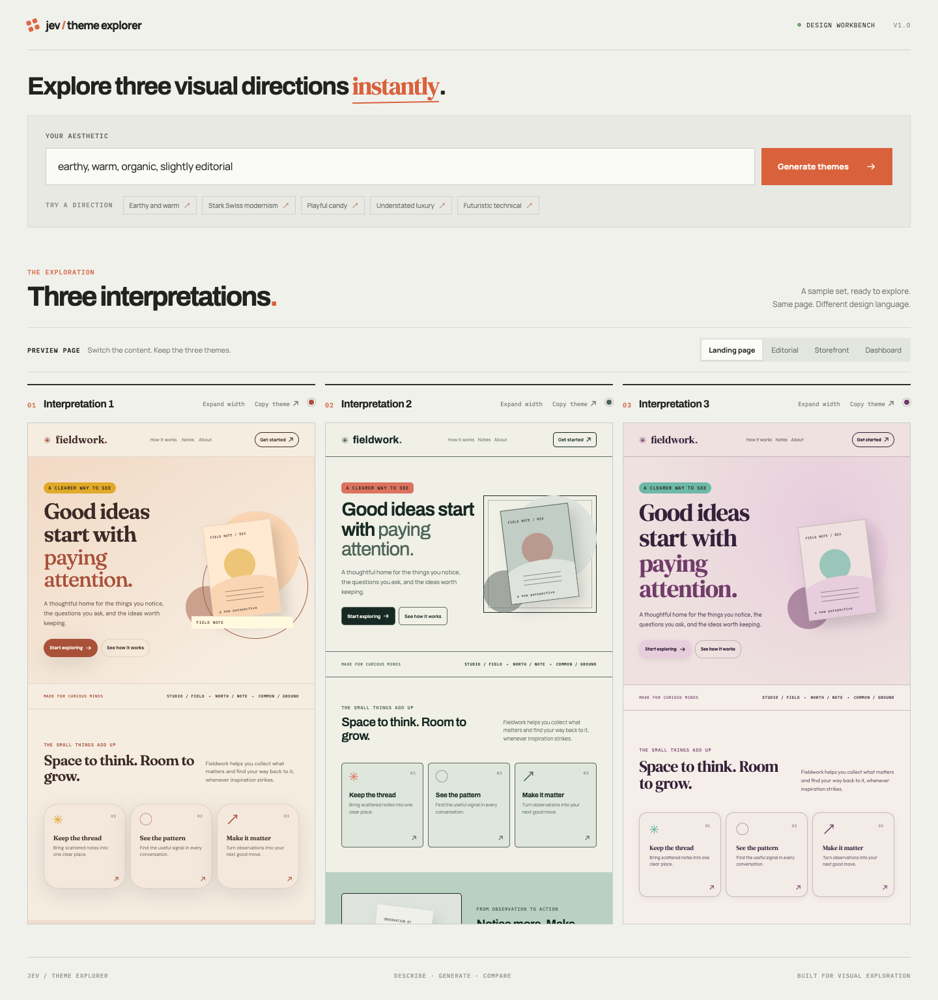
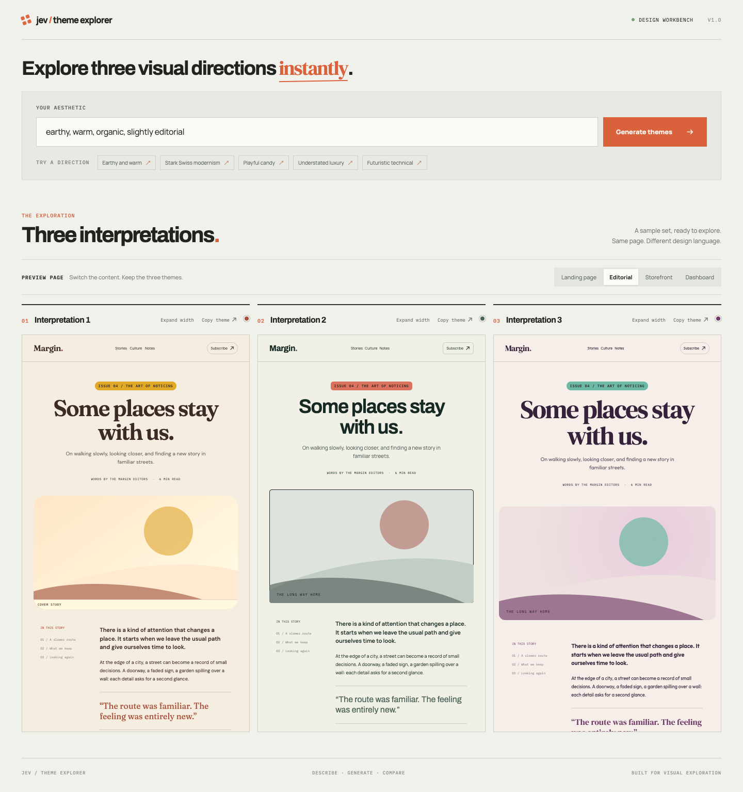

# Jev Theme Explorer

Turn one aesthetic prompt into three design directions. Jev chooses from a curated vocabulary; the app renders and compares the results across the same sample pages.



## How it works

1. The browser sends your prompt to the Express server. The server calls Jev `systemOne` with a TypeSafe `choice` question for each design property.
2. Jev returns probability scores. For every property, the app assigns the highest, second-highest, and third-highest options to three themes. These are ranked choices, not three whole-theme scores.
3. The client maps those semantic choices to curated colors, type, spacing, shape, and treatments, then renders them with CSS. The app owns the visual rules; Jev does not generate CSS.
4. Switch between Landing, Editorial, Storefront, and Dashboard to compare the same three themes on different content. Copy a theme as versioned JSON with its choices, resolved tokens, and CSS variables.

Palette-aware accent pairings keep the second color distinct and readable. Sample pages are illustrative; the storefront does not process purchases.



## Run locally

1. Add `TYPESAFE_API_KEY=...` to `.env.local` (server only; do not use a `VITE_` prefix).
2. Run `pnpm install`, then `pnpm dev` and open the URL printed in the terminal.

Without a working API key, the app can still display its built-in sample themes. See [ASSUMPTIONS.md](ASSUMPTIONS.md) for implementation decisions.

## Deploy to Cloudflare Pages

Build the static site and Pages Function bundle with `pnpm run build:pages`, then deploy the `dist` directory with Wrangler:

```sh
pnpm run build:pages
pnpm dlx wrangler@4.140.0 pages deploy dist --project-name jev-theme-designer --branch main
```

Set `TYPESAFE_API_KEY` as a Cloudflare Pages production secret. Keep it server-side; do not use a `VITE_` prefix.
